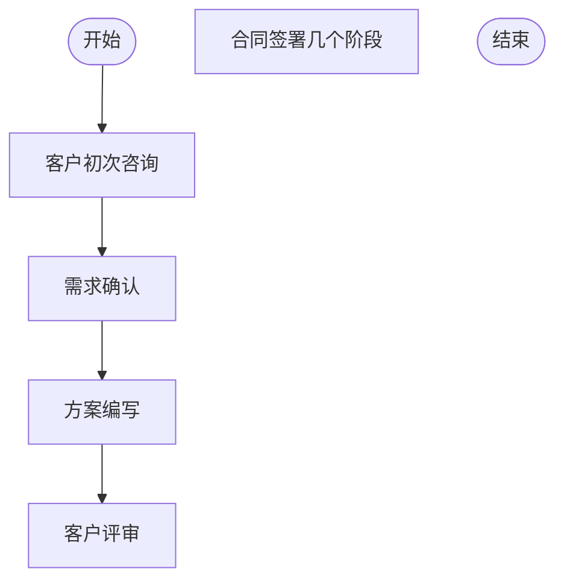

# 灵感模式 Mermaid

## 测试输入

```text
我想做一个销售跟进流程，包含客户初次咨询、需求确认、方案编写、客户评审、合同签署几个阶段。
```

## Mermaid 输出



## 结构校验

- 是否包含 flowchart 或 graph 声明：是
- 业务节点数量：6
- 连接关系数量：4
- 是否包含判断节点：否
- 是否通过结构校验：是

## 测试结论

- 是否成功：成功
- 是否调用 LLM：否
- 生成来源：rule-linear-plan
- 是否生成 Mermaid：是
- Mermaid 是否通过结构校验：是
- 是否成功渲染流程图：是
- 是否可用于演示：是
- 响应耗时：0.087 秒
