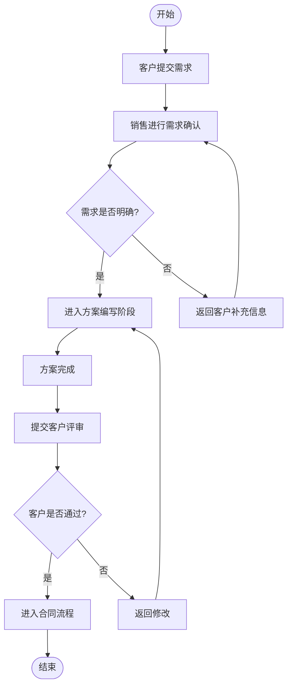

# 标准模式 Mermaid

## 测试输入

```text
客户提交需求后，销售进行需求确认。需求明确则进入方案编写，需求不明确则返回客户补充信息。方案完成后提交客户评审，客户通过后进入合同流程，未通过则返回修改。
```

## Mermaid 输出



## 结构校验

- 是否包含 flowchart 或 graph 声明：是
- 业务节点数量：12
- 连接关系数量：13
- 是否包含判断节点：是
- 是否通过结构校验：是

## 测试结论

- 是否成功：成功
- 是否调用 LLM：否
- 生成来源：rule-sales-process
- 是否生成 Mermaid：是
- Mermaid 是否通过结构校验：是
- 是否成功渲染流程图：是
- 是否可用于演示：是
- 响应耗时：0.007 秒
