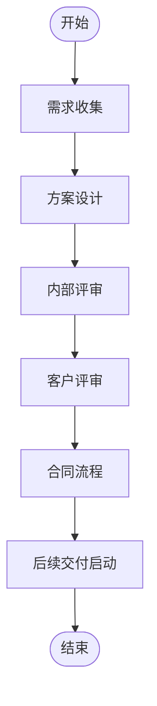

# 计划模式 Mermaid

## 测试输入

```text
请为企业客户项目售前流程生成计划流程图，包含需求收集、方案设计、内部评审、客户评审、合同流程和后续交付启动。
```

## Mermaid 输出



## 结构校验

- 是否包含 flowchart 或 graph 声明：是
- 业务节点数量：8
- 连接关系数量：7
- 是否包含判断节点：否
- 是否通过结构校验：是

## 测试结论

- 是否成功：成功
- 是否调用 LLM：否
- 生成来源：rule-linear-plan
- 是否生成 Mermaid：是
- Mermaid 是否通过结构校验：是
- 是否成功渲染流程图：是
- 是否可用于演示：是
- 响应耗时：0.024 秒
