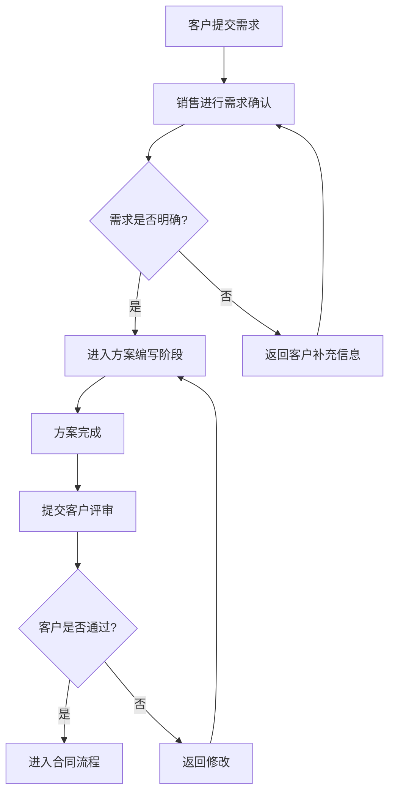

# Mermaid 代码模式 Mermaid

## 测试输入

```text
flowchart TD
    A[客户提交需求] --> B[销售进行需求确认]
    B --> C{需求是否明确?}
    C -- 是 --> D[进入方案编写阶段]
    C -- 否 --> E[返回客户补充信息]
    E --> B
    D --> F[方案完成]
    F --> G[提交客户评审]
    G --> H{客户是否通过?}
    H -- 是 --> I[进入合同流程]
    H -- 否 --> J[返回修改]
    J --> D
```

## Mermaid 输出



## 结构校验

- 是否包含 flowchart 或 graph 声明：是
- 业务节点数量：10
- 连接关系数量：11
- 是否包含判断节点：是
- 是否通过结构校验：是

## 测试结论

- 是否成功：成功
- 是否调用 LLM：否
- 生成来源：manual-code
- 是否生成 Mermaid：是
- Mermaid 是否通过结构校验：是
- 是否成功渲染流程图：是
- 是否可用于演示：是
- 响应耗时：0.000 秒
