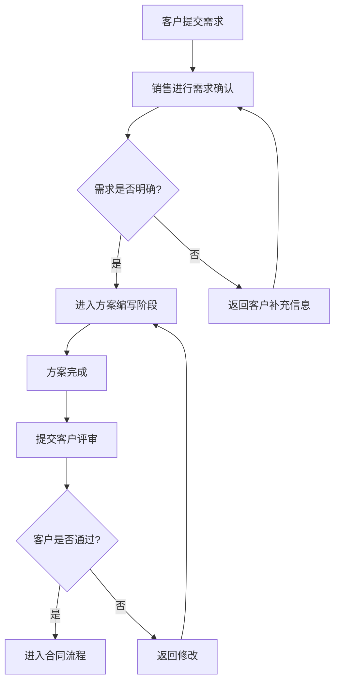

# AutoFlow Mermaid 示例

## 示例输入

```text
客户提交需求后，销售先进行需求确认。如果需求明确，进入方案编写阶段；如果需求不明确，返回客户补充信息。方案完成后提交客户评审，客户通过后进入合同流程，未通过则返回修改。
```

## Mermaid 输出

说明：本示例是在复现过程中基于用户输入手工整理的替代演示输出，并已使用源项目 `MermaidValidatorTool` 校验为 `VALID`。完整标准模式需要配置真实 LLM 环境变量后由 Agent 生成。


