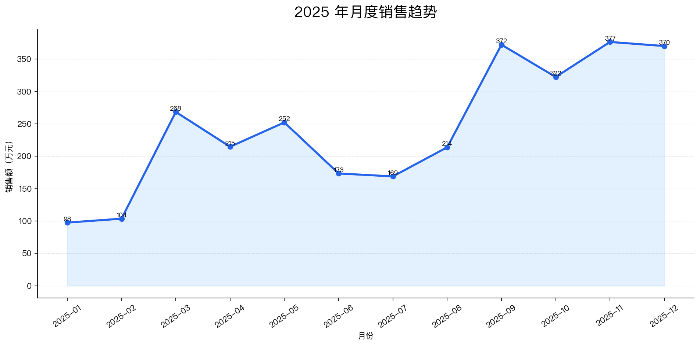
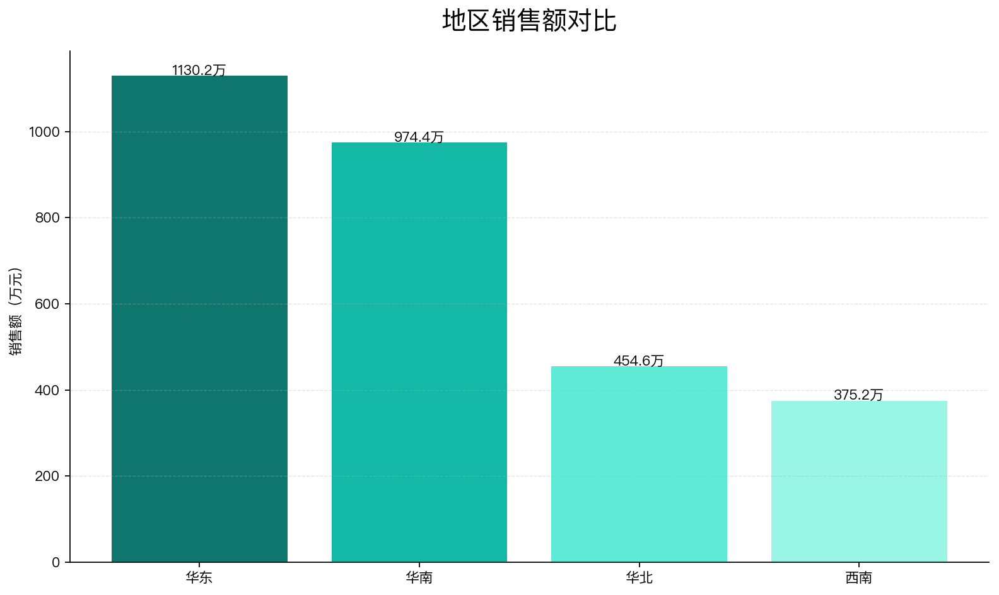
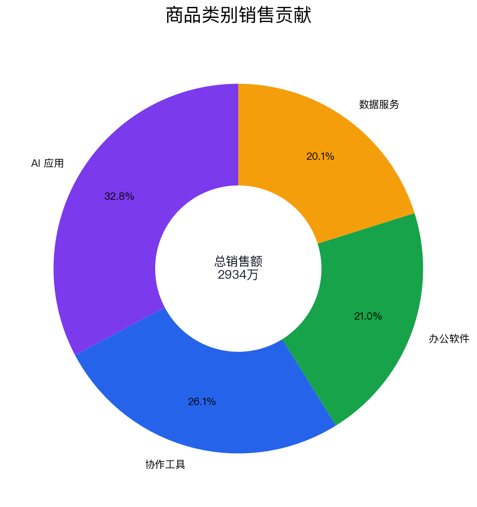
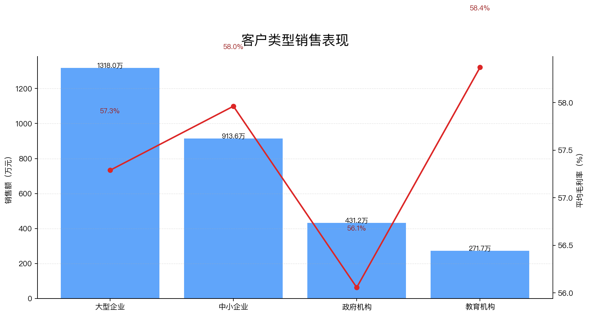

# 企业经营数据分析报告

> 本报告基于模拟销售数据生成，用于企业经营数据分析 Agent 的本地演示。正式使用时需要接入企业实际业务数据并进行人工复核。

## 1. 分析目标

本次分析使用 2025 年全年模拟销售数据，围绕销售规模、月份趋势、地区表现、商品类别贡献、客户类型差异和毛利率情况进行结构化经营分析，形成适合公开演示的报告样例。

## 2. 数据概览

- 数据文件：`assets/reports/business-data-analysis-agent/sample-sales-data.csv`
- 数据量：320 行，8 个业务字段
- 时间范围：2025-01-01 至 2025-12-29
- 地区：华北, 华东, 华南, 西南
- 客户类型：中小企业, 大型企业, 政府机构, 教育机构
- 商品类别：办公软件, 协作工具, 数据服务, AI 应用
- 数据来源：人工构造的模拟销售数据，不包含实际企业、实际客户或真实订单。

## 3. 核心指标

| 指标 | 数值 |
| --- | ---: |
| 全年销售额 | 29,344,900 元 |
| 全年订单数 | 2,362 单 |
| 平均订单金额 | 12,424 元 |
| 加权平均毛利率 | 59.0% |
| 最高销售月份 | 2025-11，3,765,600 元 |
| 最高销售地区 | 华东，11,302,100 元 |
| 最高贡献类别 | AI 应用，9,611,000 元 |

## 4. 月度销售趋势

销售额从年初逐步回升，并在第四季度达到高位。2025-11 是全年销售峰值，2025-01 为相对低点。该走势用于演示 Agent 如何识别年度节奏和重点经营月份，不代表真实行业季节性结论。

## 5. 地区销售表现

地区维度中，华东 销售额最高，说明模拟数据中东部和南部市场承载了更高订单规模。后续如果接入真实数据，应进一步拆解地区销售额、订单数、客单价和毛利率之间的关系。

## 6. 商品类别贡献

商品类别中，AI 应用 贡献最高。AI 应用和数据服务通常具有更高客单价和毛利率，在模拟数据中承担增长和利润贡献角色；办公软件和协作工具更适合承担基础装机和客户覆盖。

## 7. 客户类型差异

客户类型维度中，大型企业 销售额最高。大型企业订单规模较大，中小企业数量更多但单笔金额相对较低，政府机构和教育机构更适合结合预算周期、采购节奏和长期服务能力进行分析。

## 8. 毛利率分析

按商品类别观察，AI 应用和数据服务毛利率相对较高，协作工具居中，办公软件较低。该差异可以帮助演示 Agent 在经营分析中同时关注规模和利润，而不是只看销售额。

## 9. 经营问题识别

1. 年初销售额相对较低，可能需要结合渠道活动、续费周期或客户预算节奏做进一步验证。
2. 地区之间销售额差异明显，后续需要区分市场容量、销售覆盖和产品组合差异。
3. 高毛利类别贡献较好，但也需要检查是否存在交付成本、续费率和客户成功成本差异。
4. 客户类型之间订单规模差异较大，建议将客户分层纳入后续分析。

## 10. 经营建议

1. 围绕第四季度高峰提前准备重点客户续费、AI 应用打包和数据服务增购方案。
2. 对华东、华南等高销售区域保留增长资源，同时评估华北、西南区域的渠道覆盖和产品组合。
3. 将 AI 应用和数据服务作为利润拉动品类，配合办公软件和协作工具形成组合销售。
4. 对大型企业侧重深度方案和续费扩容，对中小企业侧重标准化套餐和低成本触达。
5. 在正式使用中增加回款、获客成本、续费率、交付工时等指标，避免只基于销售额做结论。

## 11. 人工复核说明

本报告为模拟数据分析样例，用于展示企业经营数据分析 Agent 的本地演示链路。正式使用时需要接入企业真实 CSV / Excel / 数据库数据，校验字段口径、统计公式、异常值处理方式和结论边界。

## 12. 后续可扩展方向

1. 接入真实 CSV / Excel 文件上传和字段映射。
2. 增加同比、环比、目标达成率和预算消耗等经营指标。
3. 增加图表自动选择、图表说明和报告模板配置。
4. 增加数据质量检测、异常订单识别和人工复核清单。
5. 将 Notebook 原型封装为可重复运行的命令行或 Web 演示入口。
