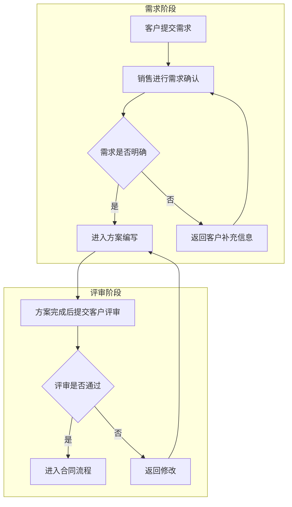

# AutoFlow 流程图生成 Agent 示例运行记录

## 示例输入

- 参考项目：`~/Documents/hello-agents/Co-creation-projects/usernamedadad-AutoFlow`
- 复现日期：2026-06-03
- 本轮测试目标：验证用户已在源项目后端本地 `.env` 中配置真实 LLM 参数后，AutoFlow 四个模式是否可用。
- 标准模式演示文本：

```text
客户提交需求后，销售先进行需求确认。如果需求明确，进入方案编写阶段；如果需求不明确，返回客户补充信息。方案完成后提交客户评审，客户通过后进入合同流程，未通过则返回修改。
```

## 执行过程

1. 阅读源项目 README、`backend/app`、`frontend/src`、依赖文件和 `.env.example`。
2. 确认后端入口为 `backend/app/main.py`，启动命令为 `uvicorn app.main:app --host 127.0.0.1 --port 8000`。
3. 确认前端入口为 Vite React 应用，启动命令为 `npm run dev -- --host 127.0.0.1 --port 5173`。
4. 已完成依赖前置修复：`backend/requirements.txt` 中的 `hello-agents=1.0.0` 已改为 `hello-agents==1.0.0`。
5. 后端启动成功，`/health` 返回 `{"status":"ok","service":"AutoFlow API"}`。
6. 前端依赖 `npm install` 成功，Vite 启动在 `http://127.0.0.1:5173/`。
7. 做最小修复：将后端 LLM timeout 默认值和运行时最低值提升到 120 秒，并更新 `backend/.env.example`。
8. 用户更换模型后，使用本地 `.env` 中的真实 LLM 参数重新测试四个模式；测试过程未读取、打印或记录真实 API Key。
9. 修复“渲染即成功”的伪成功问题：新增 Mermaid 结构校验，检查图声明、节点数、连接数、整段输入节点和条件分支判断节点。
10. 为降低演示等待时间，新增规则优先的快速路径：灵感模式、标准模式先尝试规则生成，规则不命中时再调用 LLM。
11. 灵感模式通过 `/api/agent/chat/stream` 命中 `rule-linear-plan`，未调用 LLM，生成 Mermaid，通过结构校验和前端渲染验证，耗时约 0.087 秒。
12. 标准模式通过 `/api/agent/chat/stream` 命中 `rule-sales-process`，未调用 LLM，生成 Mermaid，通过结构校验和前端渲染验证，耗时约 0.007 秒。
13. 调用计划模式 `/api/plan`，命中 `rule-linear-plan`，生成结构化线性 Mermaid，包含 8 个节点和 7 条连接，并通过前端渲染验证。
14. 使用 Mermaid 代码模式粘贴示例 Mermaid，通过结构校验并成功渲染流程图。

## 工具调用记录

| 步骤 | 工具 | 输入 | 输出 |
| --- | --- | --- | --- |
| 1 | `curl /health` | 后端地址 | 健康检查成功 |
| 2 | `/api/agent/chat/stream` | 灵感模式输入 | 命中规则快速路径，未调用 LLM，结构校验和渲染均通过 |
| 3 | `/api/agent/chat/stream` | 标准模式输入 | 命中规则快速路径，未调用 LLM，结构校验和渲染均通过 |
| 4 | `/api/plan` | 计划模式输入 | 不调用 LLM，规则生成结构化 Mermaid，结构校验和渲染均通过 |
| 5 | Mermaid 代码模式 | 手工 Mermaid 示例 | 结构校验和渲染均通过 |

## 示例输出

四模式测试总表已保存到 [autoflow-four-modes-test.md](/Users/wangyu/Documents/agent-portfolio-cases/assets/reports/autoflow-agent/autoflow-four-modes-test.md)。

最终字幕版演示视频已保存到 [autoflow-agent-demo.mp4](/Users/wangyu/Documents/agent-portfolio-cases/assets/demos/autoflow-agent/autoflow-agent-demo.mp4)。

各模式 Mermaid 记录：

- [01-inspiration-mode-mermaid.md](/Users/wangyu/Documents/agent-portfolio-cases/assets/reports/autoflow-agent/01-inspiration-mode-mermaid.md)
- [02-standard-mode-mermaid.md](/Users/wangyu/Documents/agent-portfolio-cases/assets/reports/autoflow-agent/02-standard-mode-mermaid.md)
- [03-plan-mode-mermaid.md](/Users/wangyu/Documents/agent-portfolio-cases/assets/reports/autoflow-agent/03-plan-mode-mermaid.md)
- [04-code-mode-mermaid.md](/Users/wangyu/Documents/agent-portfolio-cases/assets/reports/autoflow-agent/04-code-mode-mermaid.md)

标准模式生成的 Mermaid 示例：



## 人工复核结论

四个模式均完成严格复测。标准模式命中销售流程规则，生成的流程图覆盖了需求提交、需求确认、信息补充、方案编写、客户评审、合同流程和退回修改，并体现判断节点，适合作为本案例的主演示路径。灵感模式对“包含多个阶段”的输入命中线性计划规则，可快速生成阶段流程；如果输入更开放，仍会进入 LLM 兜底。计划模式已修复单节点伪成功问题：对“包含 A、B、C...”类输入会拆解为开始、多个处理步骤和结束节点，可用于线性计划转换演示。

## 当前不足

- 默认系统 Python 为 3.8.7，低于项目要求；本次使用 Codex 打包 Python 3.12.13 建立临时虚拟环境复现。
- 灵感模式和标准模式对当前演示输入已不依赖外部模型服务，本轮分别约 0.087 秒和 0.007 秒。
- 规则快速路径适合常见销售流程和线性计划；超出规则覆盖范围时仍会进入 LLM，耗时取决于模型服务。
- 灵感模式规则结果偏向阶段拆解，复杂业务条件仍需要人工检查完整性。
- `/api/plan` 当前适合线性计划转换；对于复杂条件分支，仍建议使用标准模式或 Mermaid 代码模式。
- 前端安装成功，但 `npm audit` 报告 12 个漏洞，尚未处理。

## 可改进方向

- 继续扩展规则快速路径，覆盖更多审批、客服、交付类常见流程。
- 增强灵感模式的结构约束，要求输出覆盖开始节点、判断节点、回退路径和结束节点。
- 继续增强不依赖 LLM 的计划模式解析能力，将常见条件词转换为 Mermaid 分支。
- 增加 Mermaid 样例测试集、自动渲染检查和前端截图。
