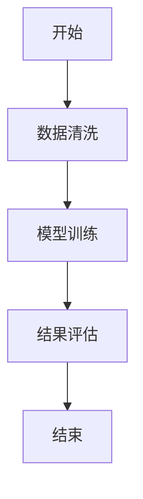

# AutoFlow 流程图生成 Agent 示例运行记录

## 示例输入

- 参考项目：`usernamedadad-AutoFlow`
- 模式一：计划模式
- 输入：

```text
开始
数据清洗
模型训练
结果评估
结束
```

- 模式二：标准模式或灵感模式，输入自然语言需求，例如“洛阳三日游计划”。

## 执行过程

1. 前端选择模式并提交输入。
2. 计划模式调用 `buildPlan`，请求后端 `/api/plan`。
3. 后端 `PlanConverter.to_mermaid` 将每行转换为节点和连线。
4. 标准/灵感模式调用 `streamAgentChat`，请求 `/api/agent/chat/stream`。
5. 后端 `MermaidPipeline` 生成 Mermaid，并调用 `MermaidValidatorTool` 校验。
6. 前端通过 Mermaid 渲染 SVG，用户可切换 TD/LR 方向、缩放、拖拽和导出。

## 工具调用记录

| 步骤 | 工具 | 输入 | 输出 |
| --- | --- | --- | --- |
| 1 | PlanConverter | 多行步骤文本 | `flowchart TD` Mermaid 代码 |
| 2 | SimpleAgent | 优化后的自然语言需求 | Mermaid 草案 |
| 3 | MermaidValidatorTool | Mermaid 草案 | `valid`、`attempts`、修复后代码 |
| 4 | Mermaid 前端渲染 | Mermaid 代码 | SVG 预览或错误信息 |

## 示例输出



## 人工复核结论

需要人工确认节点是否完整、流程顺序是否符合业务语义、是否缺少判断分支或异常路径。Validator 只能做基础结构校验，不能替代业务流程确认。

## 当前不足

- Validator 主要检查结构，不能覆盖全部 Mermaid 语法和业务逻辑。
- 自动修复次数有限，复杂错误仍需人工调整。
- 当前作品集尚未整理源项目截图到 `assets/screenshots/`。

## 可改进方向

- 增加 Mermaid 样例测试集。
- 增加流程图复杂度控制和模板选择。
- 增加 BPMN 或泳道图导出方向。
