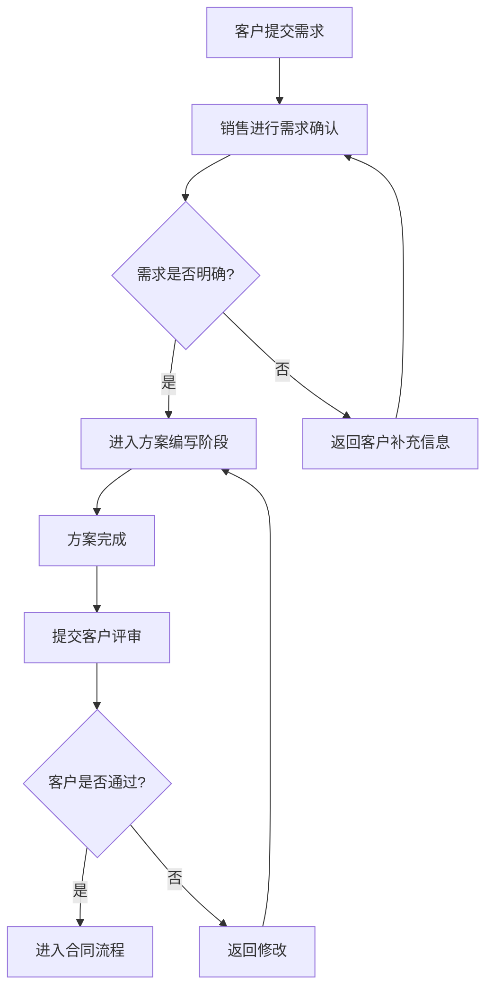

# AutoFlow 流程图生成 Agent 示例运行记录

## 示例输入

- 参考项目：`~/Documents/hello-agents/Co-creation-projects/usernamedadad-AutoFlow`
- 复现日期：2026-06-03
- 演示文本：

```text
客户提交需求后，销售先进行需求确认。如果需求明确，进入方案编写阶段；如果需求不明确，返回客户补充信息。方案完成后提交客户评审，客户通过后进入合同流程，未通过则返回修改。
```

## 执行过程

1. 阅读源项目 README、`backend/app`、`frontend/src`、依赖文件和 `.env.example`。
2. 确认后端入口为 `backend/app/main.py`，启动命令为 `uvicorn app.main:app --host 127.0.0.1 --port 8000`。
3. 确认前端入口为 Vite React 应用，启动命令为 `npm run dev -- --host 127.0.0.1 --port 5173`。
4. 原样执行后端依赖安装时，`backend/requirements.txt` 因 `hello-agents=1.0.0` 写法非法而失败。
5. 使用临时虚拟环境手动安装等价依赖后，后端成功启动，`/health` 返回 `{"status":"ok","service":"AutoFlow API"}`。
6. 前端依赖 `npm install` 成功，Vite 启动在 `http://127.0.0.1:5173/`。
7. 调用标准模式 SSE 接口时，因为未配置真实 `LLM_MODEL_ID` 和 API Key，返回错误：`必须提供模型名称（model参数或LLM_MODEL_ID环境变量）`。
8. 采用替代演示方案：基于输入手工整理 Mermaid，并用源项目 `MermaidValidatorTool` 校验为 `VALID`。

## 工具调用记录

| 步骤 | 工具 | 输入 | 输出 |
| --- | --- | --- | --- |
| 1 | `curl /health` | 后端地址 | 健康检查成功 |
| 2 | `/api/plan` | 单行需求文本 | 返回单节点 `flowchart TD` |
| 3 | `/api/agent/chat/stream` | 标准模式需求文本 | SSE 状态正常，LLM 配置缺失时报错 |
| 4 | `MermaidValidatorTool` | 手工整理 Mermaid | `VALID`，无结构错误 |

## 示例输出

Mermaid 示例已保存到 [autoflow-mermaid-example.md](/Users/wangyu/Documents/agent-portfolio-cases/assets/reports/autoflow-mermaid-example.md)。



## 人工复核结论

该流程图覆盖了需求提交、需求确认、信息补充、方案编写、客户评审、合同流程和退回修改。需要业务人员进一步确认“客户补充信息后是否一定回到销售确认”和“未通过评审后是否回到方案编写”这两个循环是否符合真实流程。

## 当前不足

- 默认系统 Python 为 3.8.7，低于项目要求；本次使用 Codex 打包 Python 3.12.13 建立临时虚拟环境复现。
- `backend/requirements.txt` 中 `hello-agents=1.0.0` 需要修正为合法 pip 约束。
- 未配置真实 LLM 密钥，标准模式和灵感模式无法完成 Agent 生成。
- `/api/plan` 适合多行线性计划；对于单段复杂业务文本，它只会生成单节点流程图。
- 前端安装成功，但 `npm audit` 报告 12 个漏洞，尚未处理。

## 可改进方向

- 修复后端依赖文件，将 `hello-agents=1.0.0` 改为 `hello-agents==1.0.0` 或项目实际支持的版本范围。
- 增加不依赖 LLM 的文本解析降级能力，将常见条件词转换为 Mermaid 分支。
- 配置真实模型后补录标准模式和灵感模式的完整 Agent 输出。
- 增加 Mermaid 样例测试集和前端截图。
