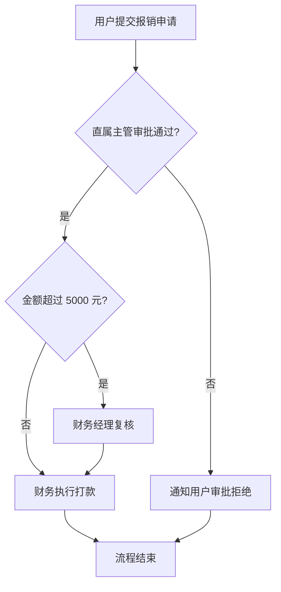

# AutoFlow 流程图生成 Agent 示例运行记录

## 示例输入

用户提交报销申请，直属主管审批。金额超过 5000 元时需要财务经理复核，否则直接进入打款。审批拒绝时流程结束并通知用户。

## 执行过程

1. 抽取角色：用户、直属主管、财务经理、财务执行。
2. 抽取动作：提交、审批、复核、打款、通知。
3. 抽取条件：金额是否超过 5000 元、是否审批通过。
4. 生成 Mermaid 流程图。
5. 列出待确认问题。

## 工具调用记录

| 步骤 | 工具 | 输入 | 输出 |
| --- | --- | --- | --- |
| 1 | 文本解析 | 流程描述 | 节点和条件 |
| 2 | Mermaid 生成 | 节点和边 | 流程图代码 |
| 3 | Markdown 生成 | Mermaid 和说明 | 示例记录 |

## 示例输出

## 人工复核结论

需要确认财务经理复核是否也存在拒绝分支，以及打款失败时是否需要补充异常流程。

## 当前不足

- 暂未渲染为图片。
- 复杂并行流程需要进一步测试。
- 缺少 BPMN 格式导出。

## 可改进方向

- 增加 Mermaid 语法校验。
- 增加流程图截图生成。
- 增加多角色泳道图支持。
